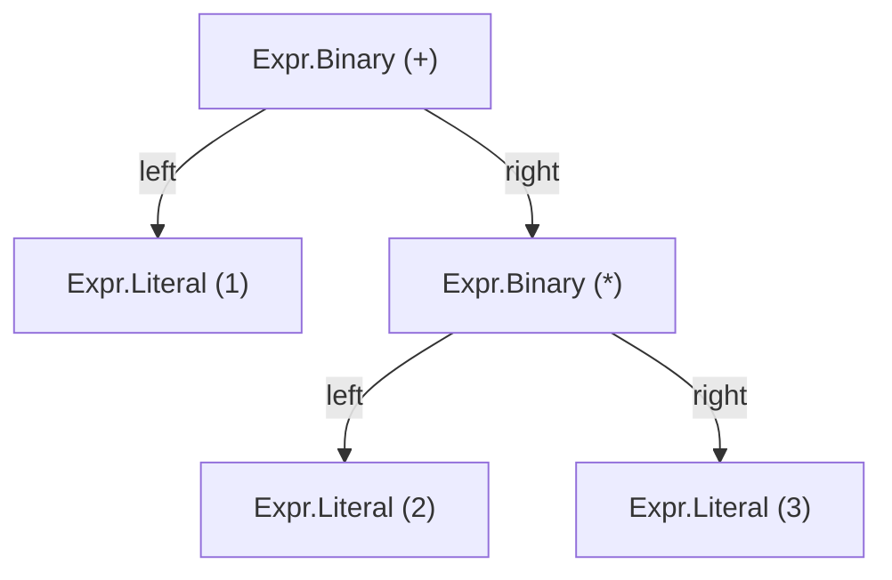
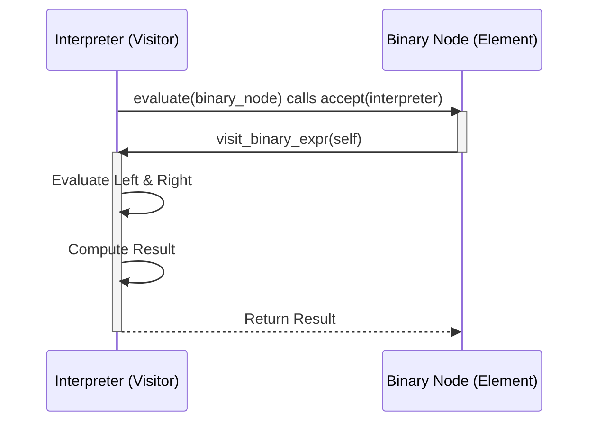
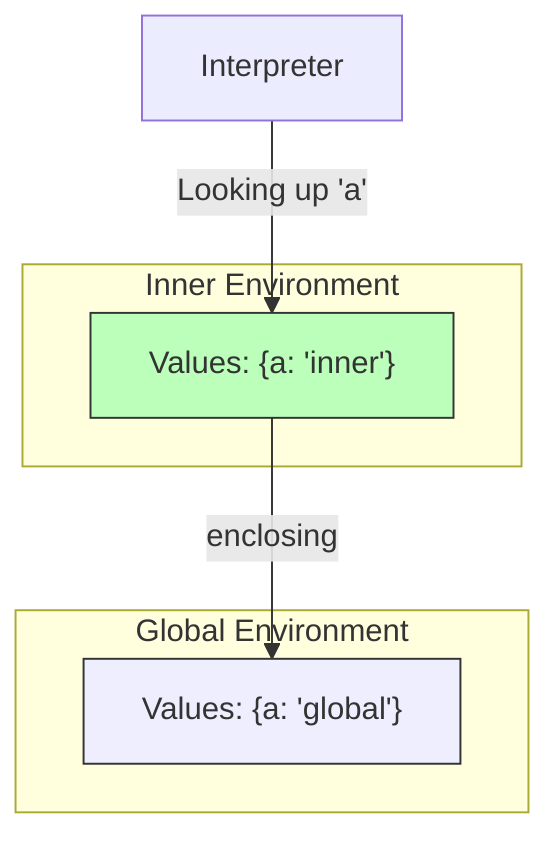

# Lox Interpreter

This project is a Python implementation of an interpreter for the Lox programming language, as described in the book _Crafting Interpreters_ by Robert Nystrom. The interpreter supports tokenization, parsing, and execution of Lox code.

---

## Architecture

### Recursive Descent Parsing

The parser uses a **Variable Recursive Descent** strategy. Each grammar rule maps to a Python function.

- **Precedence Handling**: Lower precedence operations (like `term` for `+`) call higher precedence functions (like `factor` for `*`) first.
- **Associativity**:
  - **Left-Associativity** (`+`, `-`, `*`, `/`) is handled via `while` loops to avoid recursion loops.
  - **Right-Associativity** (Assignment `=`, Unary `!`) is handled via recursive calls.



### Visitor Pattern

The interpreter uses the **Visitor Pattern** to separate the data classes (`Expr`, `Stmt`) from the operations performed on them (`Interpreter`, `Resolver`, `AstPrinter`).

- **Double Dispatch**: Nodes call `accept(visitor)`, which calls back `visitor.visit_specific_node(self)`.
- **Extensibility**: New operations (like a Linter or Optimizer) can be added by creating a new Visitor without changing the AST classes.




### Environment & Variable Scope

Variables are managed using **Environment Chaining**, implemented as a linked list of hash maps.

- **Shadowing**: The interpreter searches the current scope first. If not found, it recursively checks the `enclosing` (parent) scope.
- **Assignment**: Variable assignment (`a = 2`) strictly modifies the *nearest* existing variable, preventing accidental creation of global variables.



---

## Project Structure

### Files and Directories

- `.codecrafters/`: Contains scripts for running and compiling the program on CodeCrafters.
- `.vscode/`: Contains Visual Studio Code configuration files.
- `app/`: Contains the main source code for the interpreter.
  - `AstPrinter.py`: Implements the AST printer for debugging.
  - `Environment.py`: Manages variable scopes and environments.
  - `error.py`: Handles error reporting.
  - `Interpreter.py`: Implements the interpreter for executing Lox code.
  - `main.py`: Entry point for the interpreter.
  - `Parser.py`: Implements the parser for generating the AST.
  - `RuntimeError.py`: Defines runtime errors.
  - `Scanner.py`: Implements the scanner for tokenizing the source code.
  - `Token.py`: Defines the `Token` class.
  - `TokensType.py`: Defines the types of tokens.
- `tool/`: Contains tools for generating AST classes.
  - `Expr.py`: Defines the expression classes.
  - `GenerateAst.py`: Script for generating AST classes.
  - `Stmt.py`: Defines the statement classes.
- `codecrafters.yml`: Configuration file for CodeCrafters.
- `Pipfile`: Defines the Python environment and dependencies.
- `Pipfile.lock`: Lock file for the Python environment.
- `README.md`: This file.
- `test.lox`: Sample Lox code for testing.
- `your_program.sh`: Script for running the program locally.

---

## Getting Started

### Prerequisites

- Python 3.12
- Pipenv

### Installation

Clone the repository:

```bash
git clone <repository_url>
cd <repository_directory>
```

---

## Running the Interpreter

To run the interpreter, use the `your_program.sh` script:

Where `<command>` can be one of the following:

- `tokenize`: Tokenizes the source code and prints the tokens.
- `parse`: Parses the source code and prints the AST.
- `evaluate`: Evaluates a single expression and prints the result.
- `run`: Executes the source code.

---

## Development

To run the program in a development environment, you can use the provided VS Code configuration. Open the project in VS Code and use the debugger to run the `main.py` module.

---

## Testing

To test the interpreter, you can use the provided `test.lox` file or create your own Lox scripts.


---

## License

This project is licensed under the MIT License. See the `LICENSE` file for details.

---

## Acknowledgements

This project follows the book _Crafting Interpreters_ by Robert Nystrom. Special thanks to the author for providing such a comprehensive guide to building interpreters.
